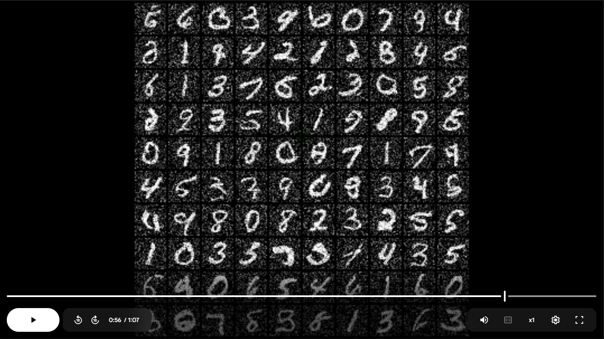

# Denoising Diffusion Probabilistic Model (DDPM) Implementation

This repository contains a **PyTorch implementation** of a Denoising Diffusion Probabilistic Model (DDPM) from scratch, based on the paper *"Denoising Diffusion Probabilistic Models"* by Ho et al. (2020).\
It includes the core diffusion process, a U-Net architecture for noise prediction, and complete training/inference pipelines.

&#x20; &#x20;

[](https://drive.google.com/file/d/1dENSu-7pEVqGHPY53-1kL2dkODRqT4YF/view?usp=drive_link)


---

##  Table of Contents

- [Overview](#overview)
- [Architecture](#architecture)
- [Implementation Details](#implementation-details)
- [Dataset Handling](#dataset-handling)
- [Training Process](#training-process)
- [Inference](#inference)
- [Dependencies](#dependencies)
- [Usage](#usage)
- [Key Features](#key-features)
- [Limitations](#limitations)
- [Future Improvements](#future-improvements)

---

##  Overview

Diffusion models are generative models that learn to reverse a gradual noising process.\
This implementation includes:

- A **forward diffusion process** that adds Gaussian noise to images.
- A **U-Net model** that learns to predict and remove noise.
- Full **training and sampling algorithms** based on the DDPM paper.

---

##  Architecture

### Core Components

#### Diffusion Process:

- Forward process: adds noise over time.
- Reverse process: learns to denoise step by step.
- Custom β-scheduling for noise variance.

#### U-Net Model:

- Encoder-decoder structure with **skip connections**.
- **Residual blocks** enhanced with time embeddings.
- **Attention mechanisms** at multiple resolutions.
- **Group normalization** layers throughout.

#### Time Embeddings:

- Sinusoidal positional encodings for timestep conditioning.

---

##  Implementation Details

### Key Files

- MNIST_Dataset.py
  - Handles loading & preprocessing for MNIST, FashionMNIST, CelebA.
  - Applies:
    - Resizing
    - Normalization to `[-1, 1]`
    - Padding for 28x28 images

- Noise_Generation.py
  - Contains `Diffusion Process`.
  - Implements:
    - β, α, and ᾱ schedule computation
    - Adding noise to the image according to a given timestep
- Train.py
    - Training loss (Algorithm 1 from the paper)
    - Sampling procedure (Algorithm 2)
    - U-Net wrapper & forward pass

- Unet.py

  - All building blocks for U-Net:
    - Residual blocks with timestep conditioning
    - Attention modules
    - Sinusoidal embeddings
    - GroupNorm

---

##  Dataset Handling

The `MNIST_DataSet` class unifies data handling across datasets:

| Dataset          | Size     | Notes                      |
| ---------------- | -------- | -------------------------- |
| **MNIST**        | 28×28    | Padded to 32×32, grayscale |
| **FashionMNIST** | 28×28    | Padded to 32×32, grayscale |
| **CelebA**       | Variable | Resized and normalized     |

All datasets are normalized to `[-1, 1]` to match DDPM requirements.(we worked only with MNIST Dataset)

---

##  Training Process

Follows **Algorithm 1** in the DDPM paper:

1. Sample a batch of images.
2. Sample timesteps `t` for each image.
3. Add Gaussian noise according to `t`.
4. Train U-Net to predict the noise using MSE loss.

### Key Parameters:

- **Timesteps (**t**)**: 1000
- **β schedule**: Linear from `1e-4` to `0.02`
- **Optimizer**: Adam, LR = `2e-4`

---

##  Inference

Sampling uses **Algorithm 2** from the paper:

1. Start with pure noise.
2. Iteratively predict and remove noise using trained U-Net.
3. At each step:
   - Predict noise
   - Subtract part of it
   - Add small noise (except last step)

Conditioned on **timestep embeddings** at each step.

---

##  Dependencies

- Python 3.x
- `torch >= 2.1.0`
- `torchvision`
- `OpenCV`
- Other: `numpy`, etc.

### Install:

```bash
pip install torch torchvision opencv-python
```


---

##  Key Features

- **Modular Design**: Independent components for U-Net, scheduler, dataset.
- **Multi-dataset Support**: Works with MNIST, FashionMNIST, CelebA.
- **Efficient & Clean**: Vectorized operations + PyTorch Lightning training loop.
- **Paper-Faithful**: Matches the algorithms from the DDPM paper.

---

##  Limitations

- Optimized for **small images** (e.g. 32×32)
- U-Net is **basic** — lacks recent architectural enhancements
- Limited to **image generation** only
- CelebA training may require **high memory**

---

##  Future Improvements

- Add **non-linear or cosine** noise schedules
- Support **DDIM sampling** for faster inference
- Add **classifier guidance** for conditional generation
- Enable **high-resolution** training

- Incorporate **advanced U-Net variants** with deeper attention

---

This implementation serves as a clean and faithful baseline for learning and extending diffusion models in PyTorch.

